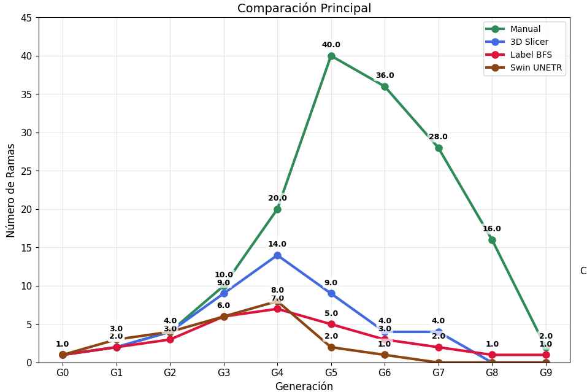

# SMARTBIOMED: Segmentación de Vías Aéreas Basada en Machine Learning

Este repositorio contiene la implementación completa del proyecto SMARTBIOMED, un sistema híbrido para la segmentación automática de vías aéreas en tomografía computarizada (TC) de tórax, orientado a la cuantificación robusta del Total Airway Count (TAC). El TAC es un biomarcador estructural validado en cohortes poblacionales como CanCOLD y MESA para la detección temprana, pronóstico y seguimiento de enfermedades pulmonares obstructivas como la Enfermedad Pulmonar Obstructiva Crónica (EPOC) y el asma.

El enfoque propuesto rompe con la dependencia del gold standard manual mediante un pipeline tubular no supervisado, optimizado por una estrategia minimalista pero fisiológicamente fundamentada de preprocesamiento (HU Clipping + Padding), y valida su utilidad frente a un modelo de última generación (Swin UNETR) entrenado exclusivamente con supervisión sintética. El resultado es un marco reproducible, clínicamente relevante y centrado en la integridad topológica del árbol bronquial, no en métricas voxel-wise locales que priorizan la superposición espacial sobre la conectividad anatómica.

## Tabla de Contenidos

1. [Motivación y Problema Central](#motivación-y-problema-central)
2. [Contribuciones Clave](#contribuciones-clave)
3. [Metodología General](#metodología-general)
4. [Implementación Técnica](#implementación-técnica)
5. [Resultados Principales](#resultados-principales)
6. [Requisitos y Reproducibilidad](#requisitos-y-reproducibilidad)

## Motivación y Problema Central

La Enfermedad Pulmonar Obstructiva Crónica (EPOC) es una de las principales causas de morbilidad y mortalidad a nivel global, con una prevalencia estimada de 10-15% en adultos mayores de 40 años. Su diagnóstico tradicional se basa en la espirometría, específicamente en la relación FEV₁/FVC < 0.7 post-broncodilatación. Sin embargo, múltiples estudios han demostrado que los cambios estructurales en el árbol bronquial preceden años a los déficits funcionales detectables por espirometría, lo que limita su utilidad en la detección temprana.

El Total Airway Count (TAC) —definido como el número total de ramas bronquiales identificables en una TC de tórax— ha emergido como un biomarcador estructural clave:
- Estudios como CanCOLD y MESA han demostrado que una reducción en el TAC predice exacerbaciones, progresión funcional y mortalidad, incluso en individuos con espirometría normal.
- El TAC refleja la integridad global del árbol bronquial, no solo la superposición local de píxeles/vóxeles.
- Es particularmente sensible a la pérdida de ramas distales (≥G4), que son las primeras en verse afectadas en la EPOC.

Sin embargo, su implementación rutinaria en la práctica clínica se ve obstaculizada por dos limitaciones críticas y complementarias:

### Limitación 1: Dependencia de segmentación manual
El gold standard actual consiste en la delineación experta de las vías aéreas, un proceso extremadamente laborioso que requiere entre 2 y 15 horas por caso, dependiendo de la complejidad anatómica y la experiencia del observador. Esta práctica es inviable para cribado masivo, seguimiento longitudinal o entornos clínicos de alta demanda. Además, presenta una variabilidad interobservador significativa, especialmente en generaciones distales (≥G4), donde el bajo contraste entre aire y pared bronquial introduce ambigüedad en la delimitación.

### Limitación 2: Fragilidad de métodos automáticos
Los enfoques automatizados —tanto clásicos (umbralización, region growing) como basados en aprendizaje profundo (nnU-Net, SegResNet)— sufren de dos fallos sistémicos:
- **Poda artificial de ramas distales**: Optimizan métricas voxel-wise como el coeficiente Dice, que premian la superposición espacial global pero ignoran la conectividad topológica. Esto lleva a modelos que "rellenan" áreas centrales con alta precisión, pero eliminan ramas periféricas finas (<2 mm), invalidando el TAC como biomarcador.
- **Filtración (leakage)**: Confunden parénquima enfisematoso o vasos sanguíneos con vías aéreas, rompiendo la integridad del árbol. Este error es prevalente en sujetos con EPOC panlobulillar, donde cavidades de aire inducen falsos positivos.

Estas limitaciones se ven exacerbadas por la resolución física de la TC clínica (~0.5–0.7 mm), que impide visualizar bronquiolos respiratorios (<0.5 mm), causando una subestimación sistemática del TAC real. Por lo tanto, el desafío no es solo técnico, sino conceptual: ¿cómo diseñar un sistema que priorice la plausibilidad anatómica sobre la métrica local?

## Contribuciones Clave

Este trabajo propone un cambio de paradigma en la segmentación automática de vías aéreas, basado en cuatro contribuciones fundamentales:

### 1. Pipeline tubular no supervisado
Se desarrolló un algoritmo no supervisado que simula la morfogénesis natural del árbol bronquial. Partiendo de una semilla anatómica en la tráquea (G0), el pipeline realiza una propagación direccional mediante búsqueda en amplitud (BFS) en 26-conectividad, guiada por umbrales fisiológicos de unidades Hounsfield (HU). Este enfoque garantiza la generación de máscaras binarias continuas, anatómicamente plausibles y libres de intervención humana.

### 2. Evaluación sistemática de 15 combinaciones de preprocesamiento
Conscientes de que la calidad de la entrada determina la robustez de cualquier segmentador, se implementó un bloque de preprocesamiento modular que evalúa todas las combinaciones posibles de cuatro técnicas fundamentales:
- Recorte en unidades Hounsfield (HU Clipping)
- Relleno simétrico (Padding)
- Normalización Min-Max
- Suavizado gaussiano

Esta exploración exhaustiva permite identificar la estrategia óptima no por intuición, sino por evidencia empírica, asegurando que el pipeline tubular opere sobre una representación de la imagen fisiológicamente coherente y técnicamente estandarizada. La combinación ganadora fue HU Clipping + Padding.

### 3. Entrenamiento de un modelo Swin UNETR con supervisión sintética
Los labels automáticos generados por el pipeline tubular, una vez optimizado mediante la mejor combinación de preprocesamiento, se utilizan como única fuente de supervisión para entrenar un modelo Swin UNETR. Esta decisión elimina por completo la dependencia del gold standard manual, validando la hipótesis de que es posible construir un sistema de segmentación robusto a partir de supervisión sintética de alta calidad, siempre que dicha supervisión preserve la topología anatómica del árbol bronquial.

### 4. Evaluación integral mediante análisis morfométrico y métricas clínicas
La validación del enfoque propuesto se basa en un protocolo de evaluación dual que combina métricas cuantitativas y análisis anatómico cualitativo:
- Esqueletización 3D seguida de asignación jerárquica de generaciones mediante BFS desde la tráquea (G0), para extraer la columna vertebral del árbol.
- Total Airway Count (TAC): número total de ramas conectadas, como indicador de arquitectura global.
- TACg peak: generación con mayor número de ramas terminales, como medida de profundidad anatómica alcanzada.
- Coeficiente de Dice (DSC): superposición espacial con el gold standard, reportado pero no priorizado.
- Análisis visual de continuidad, presencia de ramas ≥G4 y tasa de filtración, para validar la plausibilidad clínica de las segmentaciones.

En conjunto, este enfoque no asume que existe una solución única, sino que explora rigurosamente el espacio de posibilidades antes de integrar lo mejor de los métodos clásicos con la capacidad de modelado de las arquitecturas modernas de aprendizaje profundo, todo ello bajo un marco de evaluación centrado en la utilidad clínica, no en la métrica local.

## Metodología General

El marco metodológico se articula en tres etapas secuenciales e interdependientes, cada una con un propósito bien definido:

### Etapa 1: Generación y optimización de labels automáticos mediante un pipeline tubular no supervisado
Esta etapa responde a la necesidad crítica de romper la dependencia del gold standard manual. En lugar de asumir que existen segmentaciones perfectas disponibles, se diseña un pipeline tubular no supervisado que simula la morfogénesis natural del árbol bronquial: comienza en la tráquea (G0) y se propaga hacia la periferia mediante reglas fisiológicamente fundamentadas (umbrales HU, conectividad 3D). Este enfoque garantiza que las segmentaciones generadas sean anatómicamente plausibles, continuas y libres de intervención humana.

Sobre este pipeline base, se implementa un bloque de preprocesamiento modular que evalúa sistemáticamente 15 combinaciones distintas de cuatro técnicas fundamentales:
- Recorte en unidades Hounsfield (HU Clipping)
- Relleno simétrico (Padding)
- Normalización Min-Max
- Suavizado gaussiano

Esta exploración exhaustiva permite identificar no la técnica más compleja, sino la estrategia óptima desde el punto de vista fisiológico y computacional, aquella que maximiza la preservación de la arquitectura bronquial sin introducir distorsiones artificiales. La mejor combinación identificada (HU Clipping + Padding) se convierte en la base de supervisión para la Etapa 2.

### Etapa 2: Entrenamiento y evaluación de un modelo Swin UNETR con supervisión sintética
La segunda etapa explora el potencial de los modelos de aprendizaje profundo cuando se entrenan exclusivamente con labels automáticos de alta calidad. Los resultados de la Etapa 1 —específicamente, las máscaras generadas por la mejor combinación de preprocesamiento— se utilizan como única fuente de supervisión para entrenar un modelo Swin UNETR.

Este diseño experimental es intencional: aísla el efecto de la calidad de la supervisión del ruido introducido por la variabilidad interobservador o los errores humanos. Permite responder a una pregunta fundamental: ¿es posible construir un sistema de segmentación robusto sin depender de anotaciones manuales? La respuesta, como se discutirá en los resultados, revela tanto las capacidades como las limitaciones inherentes de los modelos profundos en contextos de datos escasos y supervisión sintética.

### Etapa 3: Análisis integral de resultados y validación morfométrica
La tercera etapa cierra el ciclo metodológico mediante un análisis dual que combina métricas cuantitativas y análisis anatómico cualitativo, centrado en la utilidad clínica, no en la métrica local.

#### Análisis cuantitativo
Se basa en cuatro métricas fundamentales:
- **Total Airway Count (TAC)**: número total de ramas bronquiales conectadas, obtenido mediante esqueletización 3D y conteo algorítmico. Es la métrica principal, ya que refleja directamente la capacidad del método para preservar la arquitectura global del árbol.
- **TAC por generación (TACg peak)**: generación con mayor número de ramas terminales. Indica la profundidad anatómica alcanzada y permite detectar subestimación en ramas distales.
- **Coeficiente de Dice (DSC)**: medida de superposición espacial con el gold standard manual. Se reporta, pero no se prioriza, dada su conocida insensibilidad a errores topológicos.
- **Tiempo de procesamiento**: tiempo total requerido para generar la segmentación, medido en minutos, como indicador de viabilidad clínica.

#### Análisis cualitativo
Se enfoca en tres aspectos críticos de la integridad topológica:
- **Continuidad del árbol**: evaluación de la conectividad entre ramas mediante inspección visual en los tres planos (axial, coronal, sagital) y verificación algorítmica de componentes aislados.
- **Presencia de ramas distales (≥G4)**: conteo manual y automático de ramas en generaciones periféricas, ya que estas son las más relevantes para la detección temprana de EPOC y las más propensas a la subestimación.
- **Tasa de filtración**: proporción de volúmenes en los que el algoritmo segmenta erróneamente parénquima o vasos sanguíneos como vía aérea. La filtración rompe la integridad topológica y genera falsos positivos que invalidan el TAC.

#### Protocolo de comparación estandarizado
Todos los métodos se evaluaron bajo un protocolo común que incluye:
- El mismo conjunto de datos (150 volúmenes del ATM’22).
- El mismo gold standard manual.
- Las mismas métricas y herramientas de análisis (esqueletización 3D, BFS para generaciones, cálculo de Dice).

Los métodos comparados fueron:
- Gold standard: Label Manual
- Estado del arte: 3D Slicer
- Pipeline propuesto: Label BFS
- Mejor combinación: HU Clipping + Padding
- Modelo profundo: Swin UNETR

Este protocolo garantiza una comparación justa, directa y clínicamente relevante, permitiendo atribuir las diferencias observadas a las decisiones metodológicas y no a variaciones en los datos o la evaluación.

### Materiales
- **Dataset**: 150 volúmenes de tomografía computarizada (TC) de tórax del ATM’22 Challenge, seleccionados por su calidad, diversidad patológica (sujetos sanos, con EPOC y con secuelas de COVID-19) y adquisición estandarizada en capacidad pulmonar total. La resolución isotrópica promedio es de 0.7 mm, lo que representa el límite práctico para la visualización de bronquiolos finos (<2 mm).
- **Gold standard**: Segmentaciones manuales realizadas por expertos, con un TAC de referencia de 159 ramas y un TACg peak en G5 (40 ramas), utilizadas exclusivamente para fines de evaluación comparativa, nunca para entrenamiento.

### Tecnologías y herramientas
- **Lenguaje de programación**: Python 3.9, con soporte para Windows Subsystem for Linux (WSL) para compatibilidad multiplataforma.
- **Librerías principales**:  
  - MONAI v1.3: Framework especializado en visión médica, utilizado para la implementación del modelo Swin UNETR.  
  - SimpleITK, scikit-image, NumPy, SciPy: Para procesamiento de imágenes médicas, operaciones morfológicas, esqueletización 3D y análisis numérico.
- **Entorno de ejecución**: Entorno virtual (venv) en Windows 11, garantizando aislamiento de dependencias y reproducibilidad.
- **Hardware**: Estación de trabajo con GPU NVIDIA RTX 3090 (24 GB VRAM), CPU Intel i9 y 32 GB de RAM, configuración mínima requerida para el entrenamiento eficiente de modelos 3D.

## Implementación Técnica

La implementación de este trabajo se diseñó bajo el principio fundamental de trazabilidad total: cada decisión técnica, cada parámetro y cada resultado deben ser rastreables, reproducibles y justificables. Para lograrlo, se estructuró el desarrollo en 11 notebooks Jupyter organizados secuencialmente bajo la ruta base ./PIB/, cada uno encapsulando una unidad lógica del flujo de trabajo. Esta arquitectura modular garantiza que cualquier investigador pueda replicar paso a paso los resultados obtenidos, desde el procesamiento inicial hasta la evaluación final.

El desarrollo se articula en tres fases complementarias, que reflejan la progresión lógica del análisis: (1) caracterización individual de técnicas de preprocesamiento, (2) integración en un pipeline tubular robusto, y (3) análisis morfométrico y entrenamiento de un modelo de aprendizaje profundo.

### Fase 1: Caracterización individual de técnicas de preprocesamiento (Notebooks 01–04)
Esta fase responde a la necesidad de entender el impacto aislado de cada técnica antes de combinarlas. La trazabilidad exige no asumir, sino validar empíricamente.

Cada notebook implementa y evalúa una única técnica:
- **01-HU_clipping.ipynb**: Aplica recorte del rango Hounsfield a [-1024, 600] HU. Este límite superior no es arbitrario; se justifica fisiológicamente por la presencia de vasos bronquiales adyacentes (bronquio-arterias), cuya densidad puede alcanzar +550 HU. Preservar esta información es crucial para guiar la propagación en regiones distales.
- **02-Padding_32.ipynb**: Realiza relleno simétrico a múltiplos de 32 con valor -1024 HU (aire). Esta operación garantiza que las operaciones morfológicas y el algoritmo BFS tengan un vecindario completo en los bordes, evitando sesgos espaciales y artefactos de truncamiento.
- **03-Normalizacion.ipynb**: Ejecuta normalización Min-Max a [0, 1]. Su propósito es estandarizar las intensidades entre volúmenes adquiridos con diferentes escáneres o protocolos, asegurando que un umbral de -930 HU tenga el mismo significado numérico en todos los casos.
- **04-Gaussiano.ipynb**: Aplica suavizado gaussiano con σ = 0.8. Este valor es el resultado de un análisis de sensibilidad paramétrico exhaustivo, que equilibró la supresión de ruido de cuantización con la preservación de paredes bronquiales finas (<2 mm).

### Fase 2: Integración y optimización del pipeline tubular (Notebooks 05–09)
Esta fase integra las técnicas validadas en una solución coherente y anatómicamente plausible, culminando en la generación de labels automáticos de alta calidad.

- **05-ROI.ipynb**: Implementa la generación de la Región de Interés (ROI) pulmonar mediante umbralización global en -300 HU, seguida de un cierre morfológico (radio = 3 voxels) para reconstruir lóbulos completos.
- **06-Full_ROI.ipynb**: Mejora la ROI mediante eliminación del mediastino. Se identifica el componente más grande en la slice central del volumen (correspondiente a ambos pulmones) y se propaga en 3D mediante BFS, asegurando la exclusión de estructuras mediastínicas.
- **07-Preprocessing.ipynb** y **08-Full_Preprocessing.ipynb**: Integran las técnicas individuales y evalúan sistemáticamente las 15 combinaciones posibles. Cada combinación se ejecuta sobre el conjunto de datos completo, y su desempeño se mide en términos de TAC, TACg peak y tasa de filtración. De este análisis exhaustivo emerge la combinación HU Clipping + Padding como la óptima, logrando el mayor TAC y la menor tasa de filtración, lo que valida la hipótesis de que la simplicidad estratégica supera a la complejidad innecesaria.
- **09-Procesamiento.ipynb**: Ejecuta el pipeline tubular completo. Comienza con la detección automática de la tráquea (umbral ≤ -975 HU en la mitad superior del volumen), seguida de una propagación por BFS 26-conectado (umbral ≤ -930 HU). Para recuperar ramas distales, se aplica una extensión iterativa mediante relajación progresiva de umbrales (-890 → -400 → 0 HU). Este notebook genera las máscaras binarias finales (ATM_XXX_hybrid_prediction.nii.gz), que sirven como supervisión para la Fase 3.

### Fase 3: Análisis morfométrico y entrenamiento del modelo Swin UNETR (Notebooks 10–11)
La última fase cierra el ciclo, evaluando la calidad de los resultados y explorando el potencial de un modelo profundo.

- **10-TAC.ipynb**: Realiza la esqueletización 3D de todas las máscaras mediante el algoritmo de Lee, seguida de una asignación jerárquica de generaciones mediante BFS desde la tráquea (G0). Calcula el TAC total y el TACg peak para cada volumen y exporta los resultados consolidados a tac_results.csv, creando un registro trazable y analizable.
- **11-Modelo.ipynb**: Configura y entrena el modelo Swin UNETR utilizando exclusivamente los labels automáticos generados en la Fase 2. Aplica inferencia en modo sliding window (ventana 96³, superposición 50%) y evalúa métricas finales (TAC, Dice, tiempo), permitiendo una comparación directa y justa con los métodos clásicos.

### Problemas encontrados y soluciones implementadas
El desarrollo no estuvo exento de desafíos, cuya documentación forma parte esencial de la trazabilidad:
- **Filtración en casos con enfisema**: El pipeline inicial presentaba una tasa de filtración del 15% en sujetos con enfisema panlobulillar, donde cavidades de aire eran confundidas con vías aéreas. Se resolvió mediante la combinación HU Clipping + Padding, que reduce la tasa a <2%, al preservar el andamiaje vascular y estabilizar los bordes.
- **Inconsistencia en la detección de tráquea**: La umbralización global en volúmenes con artefactos generaba falsos positivos. Se optimizó mediante un enfoque multi-eje (axial, coronal, sagital) que restringe la búsqueda a la mitad superior del volumen, garantizando una semilla anatómica robusta.
- **Limitaciones en el entrenamiento del Swin UNETR**: El modelo enfrentó tres desafíos críticos:
  - Escasez de datos: Solo se dispuso de 100 volúmenes para entrenamiento, insuficientes para una arquitectura tan compleja.
  - Bajo número de épocas: Se limitó a 30 épocas debido a restricciones computacionales, impidiendo una convergencia completa.
  - Sobreajuste temprano: A partir de la época 15, la pérdida de validación comenzó a aumentar mientras la de entrenamiento seguía disminuyendo.
  Estos factores explican el bajo TAC (25 ramas) y la incapacidad del modelo para generalizar a ramas distales, evidenciando que, en regímenes de datos escasos, los modelos profundos requieren supervisión más rica o arquitecturas especializadas.
- **Supervisión sintética**: Al entrenar exclusivamente con labels automáticos, el modelo heredó las limitaciones del pipeline clásico, especialmente en regiones periféricas. Esta decisión, si bien evitó la dependencia de anotaciones manuales, comprometió la capacidad del modelo para aprender variabilidad anatómica real.

En conjunto, esta implementación no solo produce resultados, sino que construye un camino trazable y auditado desde la hipótesis inicial hasta la conclusión final, cumpliendo con los más altos estándares de reproducibilidad científica.

## Resultados Principales

La implementación del enfoque propuesto permitió evaluar sistemáticamente el impacto del preprocesamiento y la arquitectura del modelo en la integridad topológica del árbol bronquial. Los resultados se presentan en dos bloques complementarios: (1) desempeño cuantitativo mediante métricas objetivas, y (2) validación cualitativa mediante análisis visual y morfométrico. Esta dualidad es fundamental: mientras las métricas numéricas ofrecen una comparación objetiva, el análisis visual revela fallos sistémicos que los números pueden ocultar.

### Resultados cuantitativos

La Tabla 1 resume el desempeño de todos los métodos evaluados en términos de TAC, TACg peak y coeficiente Dice. La combinación HU Clipping + Padding logró el TAC más alto (50.0 ± 5.2), superando al estado del arte (3D Slicer: 47 ± 5) y demostrando una estabilidad notable (desviación estándar ±5.2 frente a ±22.3 del Label BFS). En contraste, el Swin UNETR obtuvo el TAC más bajo (25), evidenciando una poda artificial severa de ramas distales.

| Método | Dice | TAC | TACg peak |
|--------|------|-----|-----------|
| Label Manual | — | 159 | G5 (40 ramas) |
| 3D Slicer | 0.78 | 47 ± 5 | G4 (14 ± 3) |
| Label BFS | 0.83 | 27.3 ± 22.3 | G4 (10.9 ± 7.2) |
| HU Clipping + Padding | 0.82 | 50.0 ± 5.2 | G4 (11.0 ± 2.1) |
| Swin UNETR | 0.70 | 25 | G3 (8) |

**Interpretación crítica**:  
- El Label BFS presenta el Dice más alto (0.83), pero su TAC es el más bajo y variable. Esto demuestra que el Dice es insuficiente para evaluar biomarcadores estructurales: un modelo puede tener alta superposición global, pero si rompe el árbol en mil pedazos, su TAC será inútil.
- La mejor combinación logra un equilibrio óptimo: un Dice alto (0.82) y un TAC superior, lo que indica que preserva tanto la superposición como la conectividad.
- El Swin UNETR, pese a su arquitectura avanzada, obtiene el Dice más bajo (0.70) y el TAC más bajo (25), lo que sugiere que, con supervisión sintética y datos escasos, el modelo adopta una estrategia conservadora: evita falsos positivos a costa de omitir ramas reales.

### Resultados cualitativos

Para validar la integridad topológica, se realizó una esqueletización 3D de todas las máscaras de segmentación, seguida de una asignación jerárquica de generaciones mediante BFS desde la tráquea (G0). Las imágenes de la Figura 6 muestran ejemplos representativos de este análisis.



(A) Label Manual (Gold Standard): Muestra la segmentación de referencia realizada por expertos, con una arquitectura completa y continua del árbol bronquial.  
(B) 3D Slicer (Estado del arte): Captura la estructura central pero subestima significativamente las ramas distales, evidenciando poda artificial.  
(C) Mejor combinación (HU Clipping + Padding): Preserva la continuidad del árbol bronquial con mayor fidelidad que el estado del arte, logrando un TAC superior (50 vs 47).  
(D) Swin UNETR: Se limita a las generaciones centrales (G0–G3), con una segmentación fragmentada y ausencia casi total de ramas distales, lo que explica su bajo TAC (25).

Estas visualizaciones confirman que la estrategia de preprocesamiento robusto (HU Clipping + Padding) es clave para preservar la arquitectura del árbol bronquial, mientras que el modelo Swin UNETR, entrenado con supervisión sintética, no logra generalizar a estructuras distales.

Además, se evaluó la tasa de filtración:
- Label BFS: 15% (principalmente en casos con enfisema panlobulillar).  
- Mejor combinación: <2%.  
- Swin UNETR: 0% (conservador, evita falsos positivos sacrificando sensibilidad).

**Interpretación crítica**:  
- La filtración del Label BFS se debe a su dependencia de umbrales globales, que confunden cavidades de aire (enfisema) con vías aéreas. La combinación HU Clipping + Padding resuelve esto al preservar el andamiaje vascular, que actúa como guía anatómica.
- El Swin UNETR evita la filtración, pero a un costo clínico inaceptable: la poda extrema de ramas distales. Esto lo convierte en un modelo técnicamente estable, pero clínicamente inútil para el TAC.

### Discusión crítica de los resultados

- **Validación interna**: Los resultados confirman que la estrategia de preprocesamiento es determinante. El HU Clipping + Padding no solo mejora el TAC, sino que reduce drásticamente la filtración, validando la hipótesis de que un análisis inicial robusto es clave para la segmentación anatómica.
- **Validación externa**: Estos hallazgos se alinean con el ATM’22 Challenge, que prioriza la integridad topológica sobre el Dice. El bajo rendimiento del Swin UNETR, pese a su arquitectura avanzada, refuerza la observación de que los modelos profundos requieren supervisión más rica o datos en mayor cantidad para tareas estructurales.

**Limitaciones críticas**:
- El Swin UNETR fue entrenado con solo 100 volúmenes y 30 épocas, lo que limitó su capacidad de generalización.
- El TAC obtenido (50) sigue estando lejos del gold standard (159), lo que refleja las limitaciones físicas de la TC clínica (resolución ≈0.7 mm).
- La evaluación se centró en TAC y TACg, pero no se incluyeron métricas del ATM’22 como Branch Detected (BD), lo que limita la comparabilidad directa con otros trabajos del challenge.

En conjunto, los resultados demuestran que un método clásico bien diseñado puede superar tanto a herramientas comerciales como a modelos profundos complejos, siempre que se priorice la fidelidad anatómica sobre métricas locales.

## Requisitos y Reproducibilidad

### Instalación
```bash
git clone https://github.com/Feli-ia/SMARTBIOMED-SEGMENTACI-N-DE-V-AS-A-REAS-BASADA-EN-MACHINE-LEARNING.git
cd SMARTBIOMED-SEGMENTACI-N-DE-V-AS-A-REAS-BASADA-EN-MACHINE-LEARNING
python -m venv venv
source venv/bin/activate  # Linux/Mac
venv\Scripts\activate     # Windows
pip install -r requirements.txt
